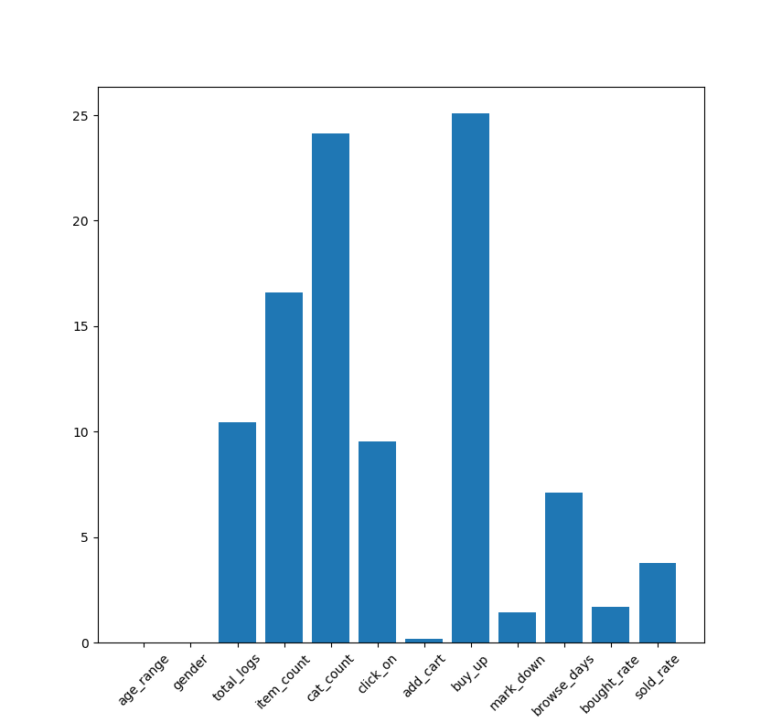

# 天猫复购预测
> 本项目是基于国内知名机器学习竞赛网站TIANCHI（天池）上的入门项目“天猫复购预测之挑战Baseline”所搭建的机器学习模型，本模型将根据商家和消费者的相关信息，预测给定的商家中新消费者在未来6个月内再次购买的概率。    
> 相关信息详见：https://tianchi.aliyun.com/competition/entrance/231576/information
---

## 官方文件
> data_format1.zip - 原始数据集，格式1    
> data_format2.zip - 原始数据集，格式2    
> sample_submission.csv - 提交样例，需要提交至官方进行测试的文件模板    
> 注：本项目中完全相同的数据集以两种不同的格式进行了组织和存储，相对地，data_format1.zip中的数据组织形式可能更便于进行特征工程以及模型训练。    
---

## 数据集
> 原始数据集中包含了匿名用户在 "双十一 "前6个月和"双十一 "当天的购物记录，标签为是否是重复购买者。训练集和测试集数据见文件data_format2.zip，数据详情见下表。    
>     
> ***用户购买信息总表***
> | 字段名称 | 描述 |    
> | --- | --- |    
> | user_id | 购物者的唯一ID编码 |    
> | age_range | 用户年龄范围。<18岁为1；[18,24]为2； [25,29]为3； [30,34]为4；[35,39]为5；[40,49]为6； > = 50时为7和8; 0和NULL表示未知 |    
> | gender | 用户性别。0表示女性，1表示男性，2和NULL表示未知 |    
> | merchant_id | 商家的唯一ID编码 |    
> | label | 取值集合为{0, 1, -1, NULL}。取1表示'userid'是'merchantid'的重复买家，取0则反之。取-1表示'user_id'不是给定商家的新客户，因此不在我们预测范围内，但这些记录可能会提供额外信息。测试集这一部分需要预测，因此为NULL |    
> | activity_log | {userid, merchantid}之间的每组交易中都记录有itemid, categoryid, brand_id, time，用#分隔。记录不按任何特定顺序排序 |    
>     
> 为了便于开展特征工程相关工作，官方还给出了另一种格式的原始数据并存储在data_format1.zip中，数据详情如下。 
>     
> ***用户行为日志(user_log_format1.csv)***    
> | 字段名称 | 描述 |    
> | --- | --- |    
> | user_id | 购物者的唯一ID编码 |    
> | item_id | 商品的唯一编码 |    
> | cat_id | 商品所属品类的唯一编码 |    
> | merchant_id | 商家的唯一ID编码 |    
> | brand_id | 商品品牌的唯一编码 |    
> | time_tamp | 购买时间（格式：mmdd） |    
> | action_type | 包含{0, 1, 2, 3}，0表示单击，1表示添加到购物车，2表示购买，3表示添加到收藏夹 |    
>     
> ***用户信息(user_info_format1.csv)***       
> | 字段名称 | 描述 |    
> | --- | --- |    
> | user_id | 购物者的唯一ID编码 |    
> | age_range | 用户年龄范围。<18岁为1；[18,24]为2； [25,29]为3； [30,34]为4；[35,39]为5；[40,49]为6； > = 50时为7和8; 0和NULL表示未知 |    
> | gender | 用户性别。0表示女性，1表示男性，2和NULL表示未知 |    
>     
> ***训练数据和测试数据相关字段(train/test_formatX.csv)***    
> | 字段名称 | 描述 |    
> | --- | --- |    
> | user_id | 购物者的唯一ID编码 |    
> | merchant_id | 商家的唯一ID编码 |    
> | label | 包含{0, 1}，1表示重复买家，0表示非重复买家。测试集这一部分需要预测，因此为空 |    
>     
> 本人使用的是data_format1.zip中的数据组织形式，为了便于训练，从上述各表中共提取了以下信息作为样本变量。    
>     
> ***样本变量表***    
> | 字段名称 | 描述 | 权重指数<up>*<up> |    
> | --- | --- | --- |    
> | total_logs | 记录总数，用户在单一店铺内访问记录的总数 | 11.81891702 |    
> | item_count | 物品计数，用户在店铺内访问物品的数量总数 | 17.72627158 |    
> | cat_count | 品类总数，用户在店铺内访问物品的品类总数 | 22.70846493 |    
> | click_on | 点击计数，用户在店铺内点击操作的总数 | 8.67718079 |    
> | add_cart | 加购计数，用户在店铺内加购操作的总数 | 0.21255074 |    
> | buy_up | 购买计数，用户在店铺内购买操作的总数 | 30.15375663 |    
> | mark_down | 收藏计数，用户在店铺内收藏操作的总数 | 2.12038133 |    
> | browse_days | 浏览天数，用户在店铺内浏览过的天数 | 6.58247698 |    
>     
> *注：表中的权重指数是基于CatBoost模型中自带的get_feature_importance()函数求解获得，原本使用的字段还包括用户的年龄范围和性别，由于该两项的权重指数为0，且在实际测试中发现，不使用年龄范围和性别时的模型推断准确率要高于使用时约3%的准确性，故决定不考虑用户年龄范围和性别在判别时的影响。    
---

## 模型训练
> 根据数据集特点和以往经验，决定在本次比赛中使用CatBoost算法训练模型。由于CatBoost算法的特点，输入的原始数据不需要经过标准化处理，同时也不需要对类别标签预先进行one-hot处理，本算法在训练过程中会自行优化相关变量，特别是对类别标签的处理性能比传统one-hot方法好很多。    
> 利用CatBoost算法中的get_feature_importance()函数，可以得知输入样本各变量对于最终推断的权重，各变量重要性权重条形图如下    
>     
> 到git push为止时本比赛的第一赛季尚未结束，使用稍微经过调参后的CatBoost模型就获得了0.6489412的推断精度，虽然距离阿里云官方Baseline的0.704954想去还有一段距离，但是也借此机会再次加深了本人对于机器学习理论和实操方面的理解，目前排名为326/3976，如果到正式赛第一赛季结束前仍未找到新的参数组合或者算法以提高模型准确率，名次可能会下跌至350名左右，但是作为前10%不得不承认，最为集成学习大家族的新鲜血液，CatBoost展现出了其不凡的性能。    
